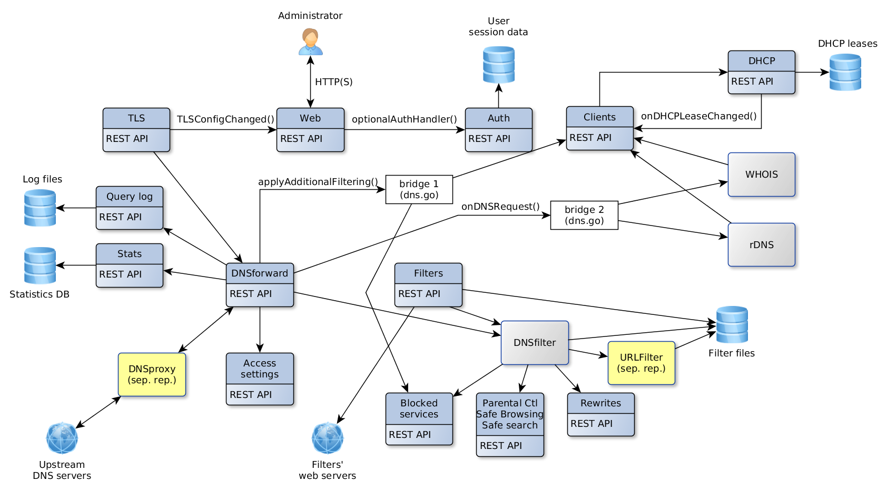
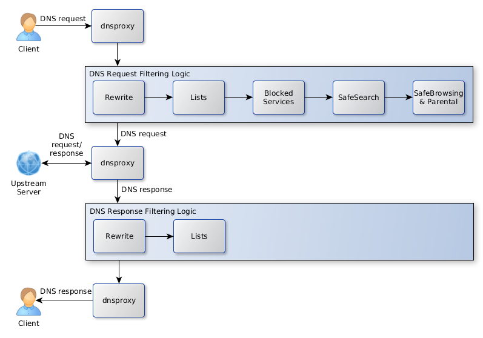

# AdGuard Home Technical Document

The document describes technical details and internal algorithms of AdGuard Home.

Contents:
* First startup
* Installation wizard
	* "Get install settings" command
	* "Check configuration" command
	* Disable DNSStubListener
	* "Apply configuration" command
* Updating
	* Get version command
	* Update command
* API: Get global status
* TLS
	* API: Get TLS configuration
	* API: Set TLS configuration
* Device Names and Per-client Settings
	* Per-client settings
	* Get list of clients
	* Add client
	* Update client
	* Delete client
	* API: Find clients by IP
* DHCP server
	* DHCP server in DNS
	* DHCP Custom Options
	* API: Show DHCP interfaces
	* API: Show DHCP status
	* API: Check DHCP
	* API: Enable DHCP
	* Static IP check/set
	* API: Add a static lease
	* API: Reset DHCP configuration
	* RA+SLAAC
* DNS general settings
	* API: Get DNS general settings
	* API: Set DNS general settings
* DNS access settings
	* List access settings
	* Set access settings
* Rewrites
	* API: List rewrite entries
	* API: Add a rewrite entry
	* API: Remove a rewrite entry
* Services Filter
	* API: Get blocked services list
	* API: Set blocked services list
* Statistics
	* API: Get statistics data
	* API: Clear statistics data
	* API: Set statistics parameters
	* API: Get statistics parameters
* Query logs
	* API: Get query log
	* API: Set querylog parameters
	* API: Get querylog parameters
* Filtering
	* Filters update mechanism
	* API: Get filtering parameters
	* API: Set filtering parameters
	* API: Refresh filters
	* API: Add Filter
	* API: Set URL parameters
	* API: Delete URL
	* API: Domain Check
* Log-in page
	* API: Log in
	* API: Log out
	* API: Get current user info
* Safe services
* ipset

## Relations between subsystems

## First startup

The first application startup is detected when there's no .yaml configuration file.

We check if the user is root, otherwise we fail with an error.

Web server is started up on port 3000 and automatically redirects requests to `/` to Installation wizard.

After Installation wizard steps are completed, we write configuration to a file and start normal operation.

## Installation wizard

This is the collection of UI screens that are shown to a user on first application startup.

The screens are:

1. Welcome
2. Set up network interface and listening ports for Web and DNS servers
3. Set up administrator username and password
4. Configuration complete
5. Done

Algorithm:

Screen 2:
* UI asks server for initial information and shows it
* User edits the default settings, clicks on "Next" button
* UI asks server to check new settings
* Server searches for the known issues
* UI shows information about the known issues and the means to fix them
* Server applies automatic fixes of the known issues on command from UI

Screen 3:
* UI asks server to apply the configuration
* Server restarts DNS server

### "Get install settings" command

Request:

	GET /control/install/get_addresses

Response:

	200 OK

	{
	"web_port":80,
	"dns_port":53,
	"interfaces":{
		"enp2s0":{"name":"enp2s0","mtu":1500,"hardware_address":"","ip_addresses":["",""],"flags":"up|broadcast|multicast"},
		"lo":{"name":"lo","mtu":65536,"hardware_address":"","ip_addresses":["127.0.0.1","::1"],"flags":"up|loopback"},
	}
	}

If `interfaces.flags` doesn't contain `up` flag, UI must show `(Down)` status next to its IP address in interfaces selector.

### "Check configuration" command

Request:

	POST /control/install/check_config

	{
	"web":{"port":80,"ip":"192.168.11.33"},
	"dns":{"port":53,"ip":"127.0.0.1","autofix":false},
	"set_static_ip": true | false
	}

Server should check whether a port is available only in case it itself isn't already listening on that port.

If `set_static_ip` is `true`, Server attempts to set a static IP for the network interface chosen by `dns.ip` setting.  If the operation is successful, `static_ip.static` setting will be `yes`.  If it fails, `static_ip.static` setting will be set to `error` and `static_ip.error` will contain the error message.

Server replies on success:

	200 OK

	{
	"web":{"status":""},
	"dns":{"status":""},
	"static_ip": {
		"static": "yes|no|error",
		"ip": "<Current dynamic IP address>", // set if static=no
		"error": "..." // set if static=error
	}
	}

If `static_ip.static` is `no`, Server has detected that the system uses a dynamic address and it can  automatically set a static address if `set_static_ip` in request is `true`.  See section `Static IP check/set` for detailed process.

Server replies on error:

	200 OK

	{
	"web":{"status":"ERROR MESSAGE"},
	"dns":{"status":"ERROR MESSAGE", "can_autofix": true|false},
	}

### Disable DNSStubListener

On Linux, if 53 port is not available, server performs several additional checks to determine if the issue can be fixed automatically.

#### Phase 1

Request:

	POST /control/install/check_config

	{
	"dns":{
		"port":53,
		"ip":"127.0.0.1",
		"autofix":false
	}
	}

Check if DNSStubListener is enabled:

	systemctl is-enabled systemd-resolved

Check if DNSStubListener is active:

	grep -E '#?DNSStubListener=yes' /etc/systemd/resolved.conf

If the issue can be fixed automatically, server replies with `"can_autofix":true`

	200 OK

	{
	"dns":{"status":"ERROR MESSAGE", "can_autofix":true},
	}

In this case UI shows "Fix" button next to error message.

#### Phase 2

If user clicks on "Fix" button, UI sends request to perform an automatic fix

	POST /control/install/check_config

	{
	"dns":{"port":53,"ip":"127.0.0.1","autofix":true},
	}

Deactivate DNSStubListener and update DNS server address.  Create a new file: `/etc/systemd/resolved.conf.d/adguardhome.conf` (create a `/etc/systemd/resolved.conf.d` directory if necessary):

	[Resolve]
	DNS=127.0.0.1
	DNSStubListener=no

Specifying "127.0.0.1" as DNS server address is necessary because otherwise the nameserver will be "127.0.0.53" which doesn't work without DNSStubListener.

Activate another resolv.conf file:

	mv /etc/resolv.conf /etc/resolv.conf.backup
	ln -s /run/systemd/resolve/resolv.conf /etc/resolv.conf

Stop DNSStubListener:

	systemctl reload-or-restart systemd-resolved

Server replies:

	200 OK

	{
	"dns":{"status":""},
	}

### "Apply configuration" command

Request:

	POST /control/install/configure

	{
	"web":{"port":80,"ip":"192.168.11.33"},
	"dns":{"port":53,"ip":"127.0.0.1"},
	"username":"u",
	"password":"p",
	}

Server checks the parameters once again, restarts DNS server, replies:

	200 OK

On error, server responds with code 400 or 500.  In this case UI should show error message and reset to the beginning.

	400 Bad Request

	ERROR MESSAGE

## Updating

Algorithm of an update by command:

* UI requests the latest version information from Server
* Server requests information from Internet;  stores the data in cache for several hours;  sends data to UI
* If UI sees that a new version is available, it shows notification message and "Update Now" button
* When user clicks on "Update Now" button, UI sends Update command to Server
* UI shows "Please wait, AGH is being updated..." message
* Server performs an update:
	* Use working directory from `--work-dir` if necessary
	* Download new package for the current OS and CPU
	* Unpack the package to a temporary directory `update-vXXX`
	* Copy the current configuration file to the directory we unpacked new AGH to
	* Check configuration compatibility by executing `./AGH --check-config`.  If this command fails, we won't be able to update.
	* Create `backup-vXXX` directory and copy the current configuration file there
	* Copy supporting files (README, LICENSE, etc.) to backup directory
	* Copy supporting files from the update directory to the current directory
	* Move the current binary file to backup directory
	* Note: if power fails here, AGH won't be able to start at system boot.  Administrator has to fix it manually
	* Move new binary file to the current directory
	* Send response to UI
	* Stop all tasks, including DNS server, DHCP server, HTTP server
	* If AGH is running as a service, use service control functionality to restart
	* If AGH is not running as a service, use the current process arguments to start a new process
	* Exit process
* UI resends Get Status command until Server responds to it with the new version.  This means that Server is successfully restarted after update.
* UI reloads itself

### Get version command

On receiving this request server downloads version.json data from github and stores it in cache for several hours.

Example of version.json data:

	{
	"version": "v0.95-hotfix",
	"announcement": "AdGuard Home v0.95-hotfix is now available!",
	"announcement_url": "",
	"download_windows_amd64": "",
	"download_windows_386": "",
	"download_darwin_amd64": "",
	"download_linux_amd64": "",
	"download_linux_386": "",
	"download_linux_arm": "",
	"download_linux_arm64": "",
	"download_linux_mips": "",
	"download_linux_mipsle": "",
	"selfupdate_min_version": "v0.0"
	}

Server can only auto-update if the current version is equal or higher than `selfupdate_min_version`.

Request:

	POST /control/version.json

	{
		"recheck_now": true | false // if false, server will check for a new version data only once in several hours
	}

Response:

	200 OK

	{
	"new_version": "v0.95",
	"announcement": "AdGuard Home v0.95 is now available!",
	"announcement_url": "http://...",
	"can_autoupdate": true
	}

If `can_autoupdate` is true, then the server can automatically upgrade to a new version.

Response when auto-update is disabled by command-line argument:

	200 OK

	{
		"disabled":true
	}

It means that update check is disabled by user.  UI should do nothing.

### Update command

Perform an update procedure to the latest available version

Request:

	POST /control/update

Response:

	200 OK

Error response:

	500

UI shows error message "Auto-update has failed"

## API: Get global status

Request:

	GET /control/status

Response:

	200 OK

	{
	"dns_addresses":["..."],
	"dns_port":53,
	"http_port":3000,
	"language":"en",
	"protection_enabled":true,
	"running":true,
	"dhcp_available":true,
    "protection_disabled_duration":0
	"version":"undefined"
	}

## DHCP server

Enable DHCP server algorithm:

* UI shows DHCP configuration screen with "Enabled DHCP" button disabled, and "Check DHCP" button enabled
* User clicks on "Check DHCP"; UI sends request to server
* Server may fail to detect whether there is another DHCP server working in the network.  In this case UI shows a warning.
* Server may detect that a dynamic IP configuration is used for this interface.  In this case UI shows a warning.
* UI enables "Enable DHCP" button
* User clicks on "Enable DHCP"; UI sends request to server
* Server sets a static IP (if necessary), enables DHCP server, sends the status back to UI
* UI shows the status

### DHCP server in DNS

DHCP leases are used in several ways by DNS module.

* For "A" DNS request we reply with an IP address leased by our DHCP server.

		< A bills-notebook.lan.
		> A bills-notebook.lan. = 192.168.1.100

* For "PTR" DNS request we reply with a hostname from an active DHCP lease.

		< PTR 100.1.168.192.in-addr.arpa.
		> PTR 100.1.168.192.in-addr.arpa. = bills-notebook.

### DHCP Custom Options

Option with arbitrary hexadecimal data:

	DEC_CODE hex HEX_DATA

where DEC_CODE is a decimal DHCPv4 option code in range [1..255]

Option with IP data (only 1 IP is supported):

	DEC_CODE ip IP_ADDR

### API: Show DHCP interfaces

Request:

	GET /control/dhcp/interfaces

Response:

	200 OK

	{
		"iface_name":{
			"name":"iface_name",
			"hardware_address":"...",
			"ipv4_addresses":["ipv4 addr", ...],
			"ipv6_addresses":["ipv6 addr", ...],
			"gateway_ip":"...",
			"flags":"up|broadcast|multicast"
		}
		...
	}

### API: Show DHCP status

Request:

	GET /control/dhcp/status

Response:

	200 OK

	{
		"enabled":false,
		"interface_name":"...",
		"v4":{
			"gateway_ip":"...",
			"subnet_mask":"...",
			"range_start":"...", // if empty: DHCPv4 won't be enabled
			"range_end":"...",
			"lease_duration":60,
		},
		"v6":{
			"range_start":"...", // if empty: DHCPv6 won't be enabled
			"lease_duration":60,
		}
		"leases":[
			{"ip":"...","mac":"...","hostname":"...","expires":"..."}
			...
		],
		"static_leases":[
			{"ip":"...","mac":"...","hostname":"..."}
			...
		]
	}

### API: Check DHCP

Request:

	POST /control/dhcp/find_active_dhcp

	vboxnet0

Response:

	200 OK

	{
		v4: {
			"other_server": {
				"found": "yes|no|error",
				"error": "Error message", // set if found=error
			},
			"static_ip": {
				"static": "yes|no|error",
				"ip": "<Current dynamic IP address>", // set if static=no
			}
		}
		v6: {
			"other_server": {
				"found": "yes|no|error",
				"error": "Error message", // set if found=error
			},
		}
	}

If `other_server.found` is:
* `no`: everything is fine - there is no other DHCP server
* `yes`: we found another DHCP server.  UI shows a warning.
* `error`: we failed to determine whether there's another DHCP server.  `other_server.error` contains error details.  UI shows a warning.

If `static_ip.static` is:
* `yes`: everything is fine - server uses static IP address.

* `no`: `static_ip.ip` contains the current dynamic IP address which we may set as static.  In this case UI shows a warning:

		Your system uses dynamic IP address configuration for interface <CURRENT INTERFACE NAME>.  In order to use DHCP server a static IP address must be set.  Your current IP address is <static_ip.ip>.  We will automatically set this IP address as static if you press Enable DHCP button.

* `error`: this means that the server failed to check for a static IP.  In this case UI shows a warning:

		In order to use DHCP server a static IP address must be set.  We failed to determine if this network interface is configured using static IP address.  Please set a static IP address manually.

### API: Enable DHCP

Request:

	POST /control/dhcp/set_config

	{
	"enabled":true,
	"interface_name":"vboxnet0",
	"v4":{
		"gateway_ip":"192.169.56.1",
		"subnet_mask":"255.255.255.0",
		"range_start":"192.169.56.100",
		"range_end":"192.169.56.200", // Note: first 3 octets must match "range_start"
		"lease_duration":60,
	},
	"v6":{
		"range_start":"...",
		"lease_duration":60,
	}
	}

Response:

	200 OK

	OK

For v4, if range_start = "1.2.3.4", the range_end must be "1.2.3.X" where X > 4.

For v6, if range_start = "2001::1", the last IP is "2001:ff".

### Static IP check/set

Before enabling DHCP server we have to make sure the network interface we use has a static IP configured.

#### Phase 1

On Debian systems DHCP is configured by `/etc/dhcpcd.conf`.

To detect if a static IP is used currently we search for line

	interface eth0

and then look for line

	static ip_address=...

If the interface already has a static IP, everything is set up, we don't have to change anything.

To get the current IP address along with netmask we execute

	ip -oneline -family inet address show eth0

which will print:

	2: eth0    inet 192.168.0.1/24 brd 192.168.0.255 scope global eth0\       valid_lft forever preferred_lft forever

To get the current gateway address:

	ip route show dev enp2s0

which will print:

	default via 192.168.0.1 proto dhcp metric 100

#### Phase 2 (Raspbian)

Step 1.

To set a static IP address we add these lines to `dhcpcd.conf`:

	interface eth0
	static ip_address=192.168.0.1/24
	static routers=192.168.0.1
	static domain_name_servers=192.168.0.1

* Don't set 'routers' if we couldn't find gateway IP
* Set 'domain_name_servers' equal to our IP

Step 2.

If we would set a different IP address, we'd need to replace the IP address for the current network configuration.  But currently this step isn't necessary.

	ip addr replace dev eth0 192.168.0.1/24

#### Phase 2 (Ubuntu)

`/etc/netplan/01-netcfg.yaml` or `/etc/netplan/01-network-manager-all.yaml`

This configuration example has a static IP set for `enp0s3` interface:

	network:
		version: 2
		renderer: networkd
		ethernets:
			enp0s3:
				dhcp4: no
				addresses: [192.168.0.2/24]
				gateway: 192.168.0.1
				nameservers:
					addresses: [192.168.0.1,8.8.8.8]

For dynamic configuration `dhcp4: yes` is set.

Make a backup copy to `/etc/netplan/01-netcfg.yaml.backup`.

Apply:

	netplan apply

Restart network:

	systemctl restart networking

or:

	systemctl restart network-manager

or:

	systemctl restart system-networkd

### API: Add a static lease

Request:

	POST /control/dhcp/add_static_lease

	{
		"mac":"...",
		"ip":"...",
		"hostname":"..."
	}

Response:

	200 OK

### Remove a static lease

Request:

	POST /control/dhcp/remove_static_lease

	{
		"mac":"...",
		"ip":"...",
		"hostname":"..."
	}

Response:

	200 OK

### API: Reset DHCP configuration

Clear all DHCP leases and configuration settings.
DHCP server will be stopped if it's currently running.

Request:

	POST /control/dhcp/reset

Response:

	200 OK

### RA+SLAAC

There are 3 options for a client to get IPv6 address:

1. via DHCPv6.
	Client doesn't receive any `ICMPv6.RouterAdvertisement` packets, so it tries to use DHCPv6.
2. via SLAAC.
	Client receives a `ICMPv6.RouterAdvertisement` packet with `Managed=false` flag and IPv6 prefix.
	Client then assigns to itself an IPv6 address using this prefix and its MAC address.
	DHCPv6 server won't be started in this case.
3. via DHCPv6 or SLAAC.
	Client receives a `ICMPv6.RouterAdvertisement` packet with `Managed=true` flag and IPv6 prefix.
	Client may choose to use SLAAC or DHCPv6 to obtain an IPv6 address.

Configuration:

	dhcp:
		...
		dhcpv6:
			...
			ra_slaac_only: false
			ra_allow_slaac: false

* `ra_slaac_only:false; ra_allow_slaac:false`: use option #1.
	Don't send any `ICMPv6.RouterAdvertisement` packets.
* `ra_slaac_only:true; ra_allow_slaac:false`: use option #2.
	Periodically send `ICMPv6.RouterAdvertisement(Flags=(Managed=false,Other=false))` packets.
* `ra_slaac_only:false; ra_allow_slaac:true`: use option #3.
	Periodically send `ICMPv6.RouterAdvertisement(Flags=(Managed=true,Other=true))` packets.

ICMPv6.RouterAdvertisement packet description:

	ICMPv6:
	Type=RouterAdvertisement(134)
	Flags
		Managed=<BOOL>
		Other=<BOOL>
	Option=Prefix information(3)
		<IPv6 address prefix (/64) of the network interface>
	Option=MTU(5)
		<...>
	Option=Source link-layer address(1)
		<MAC address>
	Option=Recursive DNS Server(25)
		<IPv6 address of DNS server>

## TLS

### API: Get TLS configuration

Request:

	GET /control/tls/status

Response:

	200 OK

	{
	"enabled":true,
	"server_name":"...",
	"port_https":443,
	"port_dns_over_tls":853,
	"port_dns_over_quic":784,
	"certificate_chain":"...",
	"private_key":"...",
	"certificate_path":"...",
	"private_key_path":"..."

	"subject":"CN=...",
	"issuer":"CN=...",
	"not_before":"2019-03-19T08:23:45Z",
	"not_after":"2029-03-16T08:23:45Z",
	"dns_names":null,
	"key_type":"RSA",
	"valid_cert":true,
	"valid_key":true,
	"valid_chain":false,
	"valid_pair":true,
	"warning_validation":"Your certificate does not verify: x509: certificate signed by unknown authority"
	}

### API: Set TLS configuration

Request:

	POST /control/tls/configure

	{
	"enabled":true,
	"server_name":"hostname",
	"force_https":false,
	"port_https":443,
	"port_dns_over_tls":853,
	"port_dns_over_quic":784,
	"certificate_chain":"...",
	"private_key":"...",
	"certificate_path":"...", // if set, certificate_chain must be empty
	"private_key_path":"..." // if set, private_key must be empty
	}

Response:

	200 OK

### API: Validate TLS configuration

Request:

	POST /control/tls/validate

    {
    "enabled":true,
    "port_https":443,
    "port_dns_over_tls":853,
    "port_dns_over_quic":784,
    "allow_unencrypted_doh":false,
    "certificate_chain":"...",
    "private_key":"...",
    "certificate_path":"...",
    "private_key_path":"...",
    "valid_cert":true,
    "valid_chain":false,
    "not_before":"2019-03-19T08:23:45Z",
    "not_after":"2029-03-16T08:23:45Z",
    "dns_names":null,
    "valid_key":true,
    "valid_pair":true
    }

Response:

	200 OK

## Device Names and Per-client Settings

When a client requests information from DNS server, he's identified by IP address.
Administrator can set a name for a client with a known IP and also override global settings for this client.  The name is used to improve readability of DNS logs: client's name is shown in UI next to its IP address.  The names are loaded from 3 sources:
* automatically from "/etc/hosts" file.  It's a list of `IP<->Name` entries which is loaded once on AGH startup from "/etc/hosts" file.
* automatically using rDNS.  It's a list of `IP<->Name` entries which is added in runtime using rDNS mechanism when a client first makes a DNS request.
* manually configured via UI.  It's a list of client's names and their settings which is loaded from configuration file and stored on disk.

### Per-client settings

UI provides means to manage the list of known clients (List/Add/Update/Delete) and their settings.  These settings are stored in configuration file as an array of objects.

Notes:

* `name`, `ip` and `mac` values are unique.

* If `mac` is set and DHCP server is enabled, IP is taken from DHCP lease table.

* If `use_global_settings` is true, then DNS responses for this client are processed and filtered using global settings.

* If `use_global_settings` is false, then the client-specific settings are used to override (enable or disable) global settings.

* If `use_global_blocked_services` is false, then the client-specific settings are used to override (enable or disable) global Blocked Services settings.

### Get list of clients

Request:

	GET /control/clients

Response:

	200 OK

	{
	clients: [
		{
			name: "client1"
			ids: ["...", ...] // IP, CIDR or MAC
			tags: ["...", ...]
			use_global_settings: true
			filtering_enabled: false
			parental_enabled: false
			safebrowsing_enabled: false
			safesearch_enabled: false
			use_global_blocked_services: true
			blocked_services: [ "name1", ... ]
			whois_info: {
				key: "value"
				...
			}
			upstreams: ["upstream1", ...]
		}
	]
	auto_clients: [
		{
			name: "host"
			ip: "..."
			source: "etc/hosts" || "rDNS"
			whois_info: {
				key: "value"
				...
			}
		}
	]
	supported_tags: ["...", ...]
	}

Supported keys for `whois_info`: orgname, country, city.

### Add client

Request:

	POST /control/clients/add

	{
		name: "client1"
		ids: ["...", ...] // IP, CIDR or MAC
		tags: ["...", ...]
		use_global_settings: true
		filtering_enabled: false
		parental_enabled: false
		safebrowsing_enabled: false
		safesearch_enabled: false
		use_global_blocked_services: true
		blocked_services: [ "name1", ... ]
		upstreams: ["upstream1", ...]
	}

Response:

	200 OK

Error response (Client already exists):

	400

### Update client

Request:

	POST /control/clients/update

	{
		name: "client1"
		data: {
			name: "client1"
			ids: ["...", ...] // IP, CIDR or MAC
			tags: ["...", ...]
			use_global_settings: true
			filtering_enabled: false
			parental_enabled: false
			safebrowsing_enabled: false
			safesearch_enabled: false
			use_global_blocked_services: true
			blocked_services: [ "name1", ... ]
			upstreams: ["upstream1", ...]
		}
	}

Response:

	200 OK

Error response (Client not found):

	400

### Delete client

Request:

	POST /control/clients/delete

	{
		name: "client1"
	}

Response:

	200 OK

Error response (Client not found):

	400

### API: Find clients by IP

This method returns the list of clients (manual and auto-clients) matching the IP list.
For auto-clients only `name`, `ids`, `whois_info`, `disallowed`, and `disallowed_rule` fields are set.  Other fields are empty.

Request:

	GET /control/clients/find?ip0=...&ip1=...&ip2=...

Response:

	200 OK

	[
	{
		"1.2.3.4": {
			name: "client1"
			ids: ["...", ...] // IP, CIDR or MAC
			use_global_settings: true
			filtering_enabled: false
			parental_enabled: false
			safebrowsing_enabled: false
			safesearch_enabled: false
			use_global_blocked_services: true
			blocked_services: [ "name1", ... ]
			whois_info: {
				key: "value"
				...
			}

			"disallowed": false,
			"disallowed_rule": "..."
		}
	}
	...
	]

* `disallowed` - whether the client's IP is blocked or not.
* `disallowed_rule` - the rule due to which the client is disallowed. If `disallowed` is `true`, and this string is empty - it means that the client IP is disallowed by the "allowed IP list", i.e. it is not included in allowed.

## DNS general settings

### API: Get DNS general settings

Request:

	GET /control/dns_info

Response:

	200 OK

	{
		"upstream_dns": ["tls://...", ...],
		"upstream_dns_file": "",
		"bootstrap_dns": ["1.2.3.4", ...],

		"protection_enabled": true | false,
		"ratelimit": 1234,
		"blocking_mode": "default" | "refused" | "nxdomain" | "null_ip" | "custom_ip",
		"blocking_ipv4": "1.2.3.4",
		"blocking_ipv6": "1:2:3::4",
		"edns_cs_enabled": true | false,
		"dnssec_enabled": true | false
		"disable_ipv6": true | false,
		"upstream_mode": "" | "parallel" | "fastest_addr"
		"cache_size": 1234, // in bytes
		"cache_ttl_min": 1234, // in seconds
		"cache_ttl_max": 1234, // in seconds
	}

### API: Set DNS general settings

Request:

	POST /control/dns_config

	{
		"upstream_dns": ["tls://...", ...],
		"upstream_dns_file": "",
		"bootstrap_dns": ["1.2.3.4", ...],

		"protection_enabled": true | false,
		"ratelimit": 1234,
		"blocking_mode": "default" | "refused" | "nxdomain" | "null_ip" | "custom_ip",
		"blocking_ipv4": "1.2.3.4",
		"blocking_ipv6": "1:2:3::4",
		"edns_cs_enabled": true | false,
		"dnssec_enabled": true | false
		"disable_ipv6": true | false,
		"upstream_mode": "" | "parallel" | "fastest_addr"
		"cache_size": 1234, // in bytes
		"cache_ttl_min": 1234, // in seconds
		"cache_ttl_max": 1234, // in seconds
	}

Response:

	200 OK

`blocking_mode`:
* default: Respond with NXDOMAIN when blocked by Adblock-style rule;  respond with the IP address specified in the rule when blocked by /etc/hosts-style rule
* NXDOMAIN: Respond with NXDOMAIN code
* Null IP: Respond with zero IP address (0.0.0.0 for A; :: for AAAA)
* Custom IP: Respond with a manually set IP address

`blocking_ipv4` and `blocking_ipv6` values are active when `blocking_mode` is set to `custom_ip`.

## DNS access settings

There are low-level settings that can block undesired DNS requests.  "Blocking" means not responding to request.

There are 3 types of access settings:
* allowed_clients: Only these clients are allowed to make DNS requests.
* disallowed_clients: These clients are not allowed to make DNS requests.
* blocked_hosts: These hosts are not allowed to be resolved by a DNS request.

### List access settings

Request:

	GET /control/access/list

Response:

	200 OK

	{
		allowed_clients: ["127.0.0.1", ...]
		disallowed_clients: ["127.0.0.1", ...]
		blocked_hosts: ["host.com", ...] // host name or a wildcard
	}

### Set access settings

Request:

	POST /control/access/set

	{
		allowed_clients: ["127.0.0.1", ...]
		disallowed_clients: ["127.0.0.1", ...]
		blocked_hosts: ["host.com", ...]
	}

Response:

	200 OK

## Rewrites

This section allows the administrator to easily configure custom DNS response for a specific domain name.
A, AAAA and CNAME records are supported.

Syntax:

	key -> value

where `key` is a host name or a wild card that matches Question in DNS request
and `value` is either:
* IPv4 address: use this IP in A response
* IPv6 address: use this IP in AAAA response
* canonical name: add CNAME record
* "`key`": CNAME exception - pass request to upstream
* "A": A exception - pass A request to upstream
* "AAAA": AAAA exception - pass AAAA request to upstream

#### Example: A record

	host.com -> 1.2.3.4

Response:

	A:
		A = 1.2.3.4
	AAAA:
		<empty>

#### Example: AAAA record

	host.com -> ::1

Response:

	A:
		<empty>
	AAAA:
		AAAA = ::1

#### Example: CNAME record

	sub.host.com -> host.com

Response:

	A:
		CNAME = host.com
		A = <IPv4 address of host.com>
	AAAA:
		CNAME = host.com
		AAAA = <IPv6 address of host.com>

#### Example: CNAME+A records

	sub.host.com -> host.com
	host.com -> 1.2.3.4

Response:

	A:
		CNAME = host.com
		A = 1.2.3.4
	AAAA:
		CNAME = host.com

#### Example: Wildcard CNAME+A record with CNAME exception

	*.host.com -> 1.2.3.4
	pass.host.com -> pass.host.com

Response to `my.host.com`:

	A:
		A = 1.2.3.4
	AAAA:
		<empty>

Response to `pass.host.com`:

	A:
		A = <IPv4 address of pass.host.com>
	AAAA:
		AAAA = <IPv6 address of pass.host.com>

#### Example: A record with AAAA exception

	host.com -> 1.2.3.4
	host.com -> AAAA

Response:

	A:
		A = 1.2.3.4
	AAAA:
		AAAA = <IPv6 address of host.com>

#### Example: pass A only

	host.com -> A

Response:

	A:
		A = <IPv4 address of host.com>
	AAAA:
		<empty>

### API: List rewrite entries

Request:

	GET /control/rewrite/list

Response:

	200 OK

	[
	{
		domain: "..."
		answer: "..."
	}
	...
	]

`domain` can be an exact host name (`www.host.com`) or a wildcard (`*.host.com`).

### API: Add a rewrite entry

Request:

	POST /control/rewrite/add

	{
		domain: "..."
		answer: "..." // "1.2.3.4" (A) || "::1" (AAAA) || "hostname" (CNAME)
	}

Response:

	200 OK

### API: Remove a rewrite entry

Request:

	POST /control/rewrite/delete

	{
		domain: "..."
		answer: "..."
	}

Response:

	200 OK

## Services Filter

Allows to quickly block popular sites globally or for specific client only.
UI manages these settings via global or per-client API.
UI and server have the same list of the services supported and this list must always be in synchronization.
UI code also contains icons for each service: `client/src/components/ui/Icons.js`.

How it works:
* UI presents the list of services which user may want to block
* Admin clicks on the checkboxes in front of the services to block and presses Save
* UI sends `Set blocked services list` or `Update client` message
* Server updates the internal configuration
* When a user sends a DNS request for a host which is blocked by these settings, he won't receive its IP address
* Query log will show that this request was blocked by "Blocked services"

Internally, all supported services are stored as a map:

	service name -> list of rules

### API: Get blocked services list of available services

Request:

	GET /control/blocked_services/services

Response:

	200 OK

	[ "name1", ... ]

### API: Get blocked services list

Request:

	GET /control/blocked_services/list

Response:

	200 OK

	[ "name1", ... ]

### API: Set blocked services list

Request:

	POST /control/blocked_services/set

	[ "name1", ... ]

Response:

	200 OK

## Statistics

Load (main thread):
. Load data from the last bucket from DB for the current hour

Runtime (DNS worker threads):
. Update current unit

Runtime (goroutine):
. Periodically check that current unit should be flushed to file (when the current hour changes)
 . If so, flush it, allocate a new empty unit

Runtime (HTTP worker threads):
. To respond to "Get statistics" API request we:
 . load all units from file
 . load current unit
 . process data from all loaded units:
  . sum up data for "total counters" output values
  . add value into "per time unit counters" output arrays
  . aggregate data for "top_" output arrays;  sort in descending order

Unload (main thread):
. Flush current unit to file

### API: Get statistics data

Request:

	GET /control/stats

Response:

	200 OK

	{
		time_units: hours | days

		// total counters:
		num_dns_queries: 123
		num_blocked_filtering: 123
		num_replaced_safebrowsing: 123
		num_replaced_safesearch: 123
		num_replaced_parental: 123
		avg_processing_time: 123.123

		// per time unit counters
		dns_queries: [123, ...]
		blocked_filtering: [123, ...]
		replaced_parental: [123, ...]
		replaced_safebrowsing: [123, ...]

		top_queried_domains: [
			{host: 123},
			...
		]
		top_blocked_domains: [
			{host: 123},
			...
		]
		top_clients: [
			{IP: 123},
			...
		]
	}

### API: Clear statistics data

Request:

	POST /control/stats_reset

Response:

	200 OK

### API: Set statistics parameters

Request:

	POST /control/stats_config

	{
		"interval": 1 | 7 | 30 | 90
	}

Response:

	200 OK

### API: Get statistics parameters

Request:

	GET /control/stats_info

Response:

	200 OK

	{
		"interval": 1 | 7 | 30 | 90
	}

## Query logs

When a new DNS request is received and processed, we store information about this event in "query log".  It is a file on disk in JSON format:

	{
	"IP":"127.0.0.1", // client IP
	"T":"...", // response time
	"QH":"...", // target host name without the last dot
	"QT":"...", // question type
	"QC":"...", // question class
	"CP":"" | "doh", // client connection protocol
	"Answer":"base64 data",
	"OrigAnswer":"base64 data",
	"Result":{
		"IsFiltered":true,
		"Reason":3,
		"Rule":"...",
		"FilterID":1,
		"ServiceName":"..."
		},
	"Elapsed":12345,
	"Upstream":"...",
	}

### Adding new data

First, new data is stored in a memory region.  When this array is filled to a particular amount of entries (e.g. 5000), we flush this data to a file and clear the array.

### Getting data

When UI asks for data from query log (see "API: Get query log"), server reads the newest entries from memory array and the file.  The maximum number of items returned per one request is limited by configuration.

### Removing old data

We store data for a limited amount of time - the log file is automatically rotated.

* On AGH startup read the first line from query logs and store its time value
* If there's no log file yet, set the time value of the first log event when the file is created
* If this time value is older than our time limit, perform file rotate procedure
* While AGH is running, check the previous condition every 24 hours

### API: Get query log

Request:

	GET /control/querylog
	?older_than=2006-01-02T15:04:05.999999999Z07:00
	&search=...
	&response_status="..."

`older_than` setting is used for paging.  UI uses an empty value for `older_than` on the first request and gets the latest log entries. To get the older entries, UI sets `older_than` to the `oldest` value from the server's response.

If search settings are set, server returns only entries that match the specified request.

`search`:
match by domain name or client IP address.
The server matches substrings by default: e.g. `adguard.com` matches `www.adguard.com`.
Strict matching can be enabled by enclosing the value in double quotes: e.g. `"adguard.com"` matches `adguard.com` but doesn't match `www.adguard.com`.

`response_status`:
* all
* filtered             - all kinds of filtering
* blocked              - blocked or blocked services
* blocked_services     - blocked services
* blocked_safebrowsing - blocked by safebrowsing
* blocked_parental     - blocked by parental control
* whitelisted          - whitelisted
* rewritten            - all kinds of rewrites
* safe_search          - enforced safe search
* processed            - not blocked, not white-listed entries

Response:

	{
	"oldest":"2006-01-02T15:04:05.999999999Z07:00"
	"data":[
	{
		"answer":[
			{
			"ttl":10,
			"type":"AAAA",
			"value":"::"
			}
			...
		],
		"original_answer":[ // Answer from upstream server (optional)
			{
			"type":"AAAA",
			"value":"::"
			}
			...
		],
		"upstream":"...", // Upstream URL starting with tcp://, tls://, https://, or with an IP address
		"answer_dnssec": true,
		"client":"127.0.0.1",
		"client_proto": "" (plain) | "doh" | "dot" | "doq",
		"elapsedMs":"0.098403",
		"filterId":1,
		"question":{
			"class":"IN",
			"host":"doubleclick.net",
			"type":"AAAA"
		},
		"reason":"FilteredBlackList",
		"rule":"||doubleclick.net^",
		"service_name": "...", // set if reason=FilteredBlockedService
		"status":"NOERROR",
		"time":"2006-01-02T15:04:05.999999999Z07:00"
	}
	...
	]
	}

The most recent entries are at the top of list.

If there are no more older entries, `"oldest":""` is returned.

### API: Set querylog parameters

Request:

	POST /control/querylog_config

	{
		"enabled": true | false
		"interval": 1 | 7 | 30 | 90
		"anonymize_client_ip": true | false // anonymize clients' IP addresses
	}

Response:

	200 OK

`anonymize_client_ip`:
1. New log entries written to a log file will contain modified client IP addresses.  Note that there's no way to obtain the full IP address later for these entries.
2. `GET /control/querylog` response data will contain modified client IP addresses (masked /24 or /112).
3. Searching by client IP won't work for the previously stored entries.

How `anonymize_client_ip` affects Stats:
1. After AGH restart, new stats entries will contain modified client IP addresses.
2. Existing entries are not affected.

### API: Get querylog parameters

Request:

	GET /control/querylog_info

Response:

	200 OK

	{
		"enabled": true | false
		"interval": 1 | 7 | 30 | 90
		"anonymize_client_ip": true | false
	}

## Filtering

This is how DNS requests and responses are filtered by AGH:

* 'dnsproxy' module receives DNS request from client and passes control to AGH
* AGH applies filtering logic to the host name in DNS Question:
	* process Rewrite rules.
		Can set CNAME and a list of IP addresses.
	* process /etc/hosts entries.
		Can set a list of IP addresses or a hostname (for PTR requests).
	* match host name against filtering lists
	* match host name against blocked services rules
	* process SafeSearch rules
	* request SafeBrowsing & ParentalControl services and process their response
* If the handlers above create a successful result that can be immediately sent to a client, it's passed back to 'dnsproxy' module
* Otherwise, AGH passes the DNS request to an upstream server via 'dnsproxy' module
* After 'dnsproxy' module has received a response from an upstream server, it passes control back to AGH
* If the filtering logic for DNS request returned a 'whitelist' flag, AGH passes the response to a client
* Otherwise, AGH applies filtering logic to each DNS record in response:
	* For CNAME records, the target name is matched against filtering lists (ignoring 'whitelist' rules)
	* For A and AAAA records, the IP address is matched against filtering lists (ignoring 'whitelist' rules)

### Filters update mechanism

Filters can be updated either manually by request from UI or automatically.
Auto-update interval can be configured in UI.  If it is 0, auto-update is disabled.
When the last modification date of filter files is older than auto-update interval, auto-update procedure is started.
If an enabled filter file doesn't exist, it's downloaded on application startup.  This includes the case when installation wizard is completed and there are no filter files yet.
When auto-update time comes, server starts the update procedure by downloading filter files.  After new filter files are in place, it restarts DNS filtering module with new rules.
Only filters that are enabled by configuration can be updated.
As a result of the update procedure, all enabled filter files are written to disk, refreshed (their last modification date is equal to the current time) and loaded.

### API: Get filtering parameters

Request:

	GET /control/filtering/status

Response:

	200 OK

	{
		"enabled": true | false
		"interval": 0 | 1 | 12 | 1*24 || 3*24 || 7*24
		"filters":[
			{
			"id":1
			"enabled":true,
			"url":"https://...",
			"name":"...",
			"rules_count":1234,
			"last_updated":"2019-09-04T18:29:30+00:00",
			}
			...
		],
		"whitelist_filters":[
			{
			"id":1
			"enabled":true,
			"url":"https://...",
			"name":"...",
			"rules_count":1234,
			"last_updated":"2019-09-04T18:29:30+00:00",
			}
			...
		],
		"user_rules":["...", ...]
	}

For both arrays `filters` and `whitelist_filters` there are unique values: id, url.
ID for each filter is assigned by Server - it's used for file names.

### API: Set filtering parameters

Request:

	POST /control/filtering/config

	{
		"enabled": true | false
		"interval": 0 | 1 | 12 | 1*24 || 3*24 || 7*24
	}

Response:

	200 OK

### API: Refresh filters

Request:

	POST /control/filtering/refresh

	{
		"whitelist": true
	}

Response:

	200 OK

	{
		"updated": 123 // number of filters updated
	}

### API: Add Filter

Request:

	POST /control/filtering/add_url

	{
		"name": "..."
		"url": "..." // URL or an absolute file path
		"whitelist": true
	}

Response:

	200 OK

### API: Set URL parameters

Request:

	POST /control/filtering/set_url

	{
	"url": "..."
	"whitelist": true
	"data": {
		"name": "..."
		"url": "..."
		"enabled": true | false
	}
	}

Response:

	200 OK

### API: Delete URL

Request:

	POST /control/filtering/remove_url

	{
	"url": "..."
	"whitelist": true
	}

Response:

	200 OK

### API: Domain Check

Check if host name is filtered.

Request:

	GET /control/filtering/check_host?name=hostname

Response:

	200 OK

	{
		"reason":"FilteredBlackList",
		"rules":{
			"filter_list_id":42,
			"text":"||doubleclick.net^",
		},
		// If we have "reason":"FilteredBlockedService".
		"service_name": "...",
		// If we have "reason":"Rewrite".
		"cname": "...",
		"ip_addrs": ["1.2.3.4", ...]
	}

There are also deprecated properties `filter_id` and `rule` on the top level of
the response object.  Their usage should be replaced with
`rules[*].filter_list_id` and `rules[*].text` correspondingly.  See the
_OpenAPI_ documentation and the `./openapi/CHANGELOG.md` file.

## Log-in page

After user completes the steps of installation wizard, he must log in into dashboard using his name and password.  After user successfully logs in, he gets the Cookie which allows the server to authenticate him next time without password.  After the Cookie is expired, user needs to perform log-in operation again.

Requests to / or /index.html without a proper Cookie get redirected to Log-In page with prompt for name and password.  The server responds with 403 to all other requests (including all API methods) without a proper Cookie.

YAML configuration:

	users:
	- name: "..."
	  password: "..." // bcrypt hash
	...

Session DB file:

	session="..." user=name expire=123456
	...

Session data is SHA(random()+name+password).
Expiration time is UNIX time when cookie gets expired.

Any request to server must come with Cookie header:

	GET /...
	Cookie: session=...

If not authenticated, server sends a redirect response:

	302 Found
	Location: /login.html

### Reset password

There is no mechanism to reset the password.  Instead, the administrator must use `htpasswd` utility to generate a new hash:

	htpasswd -B -n -b username password

It will print `username:<HASH>` to the terminal.  `<HASH>` value may be used in AGH YAML configuration file as a value to `password` setting:

	users:
	- name: "..."
	  password: <HASH>

### API: Log in

Perform a log-in operation for administrator.  Server generates a session for this name+password pair, stores it in file.  UI needs to perform all requests with this value inside Cookie HTTP header.

Request:

	POST /control/login

	{
		name: "..."
		password: "..."
	}

Response:

	200 OK
	Set-Cookie: session=...; Expires=Wed, 09 Jun 2021 10:18:14 GMT; Path=/; HttpOnly

### API: Log out

Perform a log-out operation for administrator.  Server removes the session from its DB and sets an expired cookie value.

Request:

	GET /control/logout

Response:

	302 Found
	Location: /login.html
	Set-Cookie: session=...; Expires=Thu, 01 Jan 1970 00:00:00 GMT

### API: Get current user info

Request:

	GET /control/profile

Response:

	200 OK

	{
	"name":"..."
	}

If no client is configured then authentication is disabled and server sends an empty response.

### Safe services

Check if host name is blocked by SB/PC service:

* For each host name component, search for the result in cache by the first 2 bytes of SHA-256 hashes of host name components (max. is 4, i.e. sub2.sub1.host.com), excluding TLD:

		hashes[] = cache_search(sha256(host.com)[0..1])
		...

	If hash prefix is found, search for a full hash sum in the cached data.
	If found, the host is blocked.
	If not found, the host is not blocked - don't request data for this prefix from the Family server again.
	If hash prefix is not found, request data for this prefix from the Family server.

* Prepare query string which is generated from the first 2 bytes (converted to a 4-character string) of SHA-256 hashes of host name components (max. is 4, i.e. sub2.sub1.host.com), excluding TLD:

		qs = ... + string(sha256(sub.host.com)[0..1]) + "." + string(sha256(host.com)[0..1]) + ".sb.dns.adguard.com."

	For PC `.pc.dns.adguard.com` suffix is used.

* Send TXT query to Family server, receive response which contains the array of complete hash sums of the blocked hosts

* Check if one of received hash sums (`hashes[]`) matches hash sums for our host name

		hashes[0] <> sha256(host.com)
		hashes[0] <> sha256(sub.host.com)
		hashes[1] <> sha256(host.com)
		hashes[1] <> sha256(sub.host.com)
		...

* Store all received hash sums in cache:

		sha256(host.com)[0..1] -> hashes[0],hashes[1],...
		sha256(sub.host.com)[0..1] -> hashes[2],...
		...

## API: Get DNS over HTTPS .mobileconfig

Request:

	GET /apple/doh.mobileconfig

Response:

	200 OK

    DOH plist file

## API: Get DNS over TLS .mobileconfig

Request:

	GET /apple/dot.mobileconfig

Response:

	200 OK

    DOT plist file

## ipset

AGH can add IP addresses of the specified in configuration domain names to an ipset list.

Prepare: user creates an ipset list and configures AGH for using it.

	1. User --( ipset create my_ipset hash:ip ) -> OS
	2. User --( ipset: host.com,host2.com/my_ipset )-> AGH

		Syntax:

			ipset: "DOMAIN[,DOMAIN].../IPSET1_NAME[,IPSET2_NAME]..."

		IPv4 addresses are added to an ipset list with `ipv4` family, IPv6 addresses - to `ipv6` ipset list.

Run-time: AGH adds IP addresses of a domain name to a corresponding ipset list.

	1. AGH --( resolve host.com )-> upstream
	2. AGH <-( host.com:[1.1.1.1,2.2.2.2] )-- upstream
	3. AGH --( ipset.add(my_ipset, [1.1.1.1,2.2.2.2] ))-> OS
